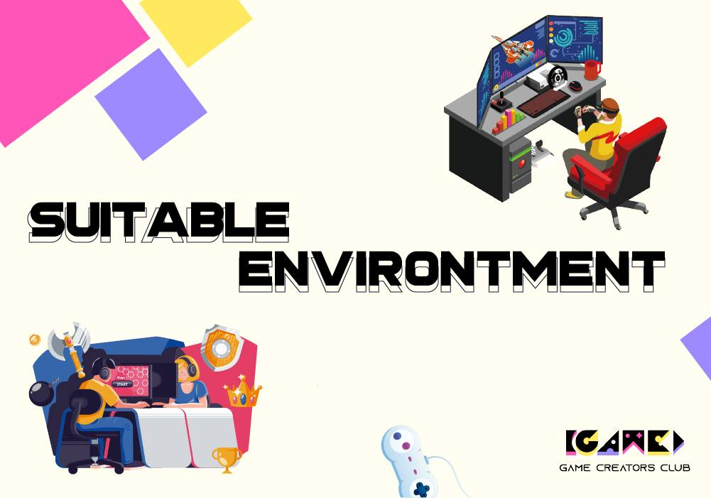
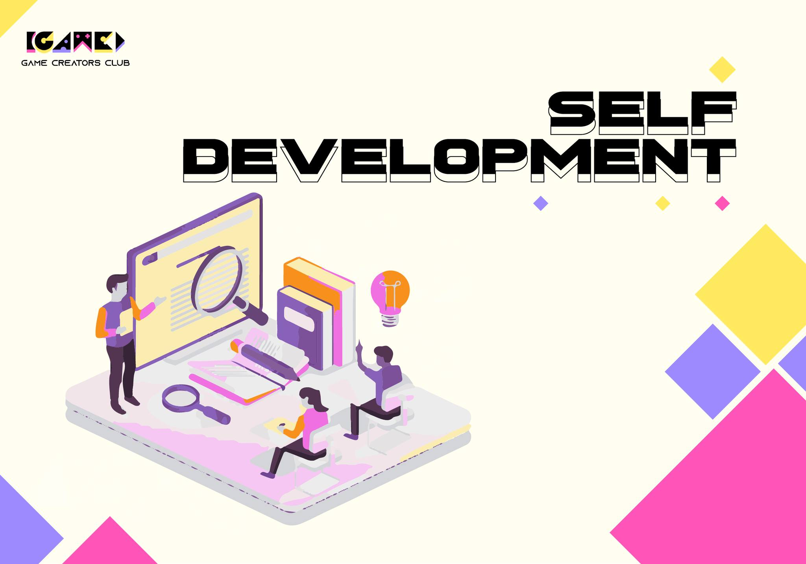
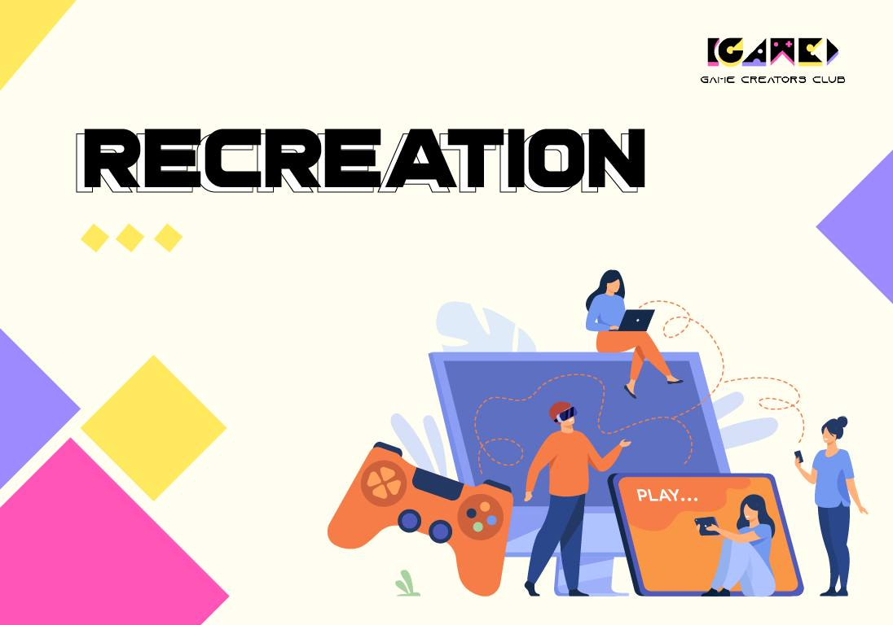

## ❓ **GCC là gì?** ❓

🌡 Trong bối cảnh thị trường Game đang "nóng" như hiện nay, có một nhu cầu lớn cho không gian và tổ chức nơi bạn trẻ có thể phát triển khả năng trong lĩnh vực game. Đáp ứng nhu cầu đó, **Game Creators Club (GCC)** được thành lập như một cộng đồng cho sinh viên mang ước mơ sáng tạo game.

## Một số bài viết

<!-- BLOG-POST-LIST:START -->
- [[KHÁM PHÁ CÁC VỊ TRÍ TRONG STUDIO GAME #1]](https://blog.gcchanoi.com/post/2024_05_24_kham_pha_cac_vi_tri_trong_studio_game_1)
- [👀 [Những sự thật thú vị có thể bạn chưa biết về Flappy Bird] 👀](https://blog.gcchanoi.com/post/2024_05_16__nhung_su_that_thu_vi_co_the_ban_chua_biet_ve_flappy_bird_)
- [❓ Game Designer là gì ❓](https://blog.gcchanoi.com/post/2024_04_01__game_designer_la_gi_)
- [Các Công Cụ Hỗ Trợ Phát Triển Game](https://blog.gcchanoi.com/post/20240324_cac_cong_cu_phat_trien_game)
- [RECAP S2B’S 11TH BIRTHDAY](https://blog.gcchanoi.com/post/2024_03_14_recap_s2bs_11th_birthday)
- [💮 CHỊ VÕ THỊ SÁU - HÌNH ẢNH NGƯỜI CON GÁI VIỆT TRONG KHÁNG CHIẾN 💮](https://blog.gcchanoi.com/post/2024_03_08_chi_vo_thi_sau__hinh_anh_nguoi_con_gai_viet_trong_khang_chien_)
- [🌟 Khám phá Cuộc Phiêu Lưu Huyền Thoại với &quot;Super Mario&quot;! 🍄](https://blog.gcchanoi.com/post/2024_02_27__kham_pha_cuoc_phieu_luu_huyen_thoai_voi_super_mario_)
- [[NHỮNG ĐIỀU SINH VIÊN CẦN LƯU Ý SAU KHI KẾT THÚC KÌ NGHỈ TẾT]](https://blog.gcchanoi.com/post/2024_02_18_nhung_dieu_sinh_vien_can_luu_y_sau_khi_ket_thuc_ki_nghi_tet)
- [[RECAP BIG GAME TRAINING]](https://blog.gcchanoi.com/post/2024_01_09_recap_big_game_training)
- [[Part 2] Chicken Invader: Những sự thật thú vị về các trò chơi kinh điển](https://blog.gcchanoi.com/post/20231113_nhung_su_that_thu_vi_ve_cac_tro_choi_kinh_dien_2)
<!-- BLOG-POST-LIST:END -->

## 🏠 **Mục tiêu của GCC:**
- Tạo điều kiện giao lưu, học hỏi và đồng hành cho các bạn trẻ đam mê Game.
- Hỗ trợ sự trưởng thành của sinh viên, khuyến khích theo đuổi đam mê trong một môi trường năng động và tích cực.

❗ **Lợi ích khi trở thành thành viên GCC:**
- Gia nhập một môi trường chung cho sinh viên đam mê Game.
- Kết nối với những người bạn cùng chí hướng và nhận sự hướng dẫn từ những tiền bối giàu kinh nghiệm.
- Trực thuộc Cộng đồng S2B, môi trường lý tưởng cho sự nghiệp game development của bạn trong tương lai.

## 🏞 **Môi trường tại GCC:**

- 🛣 Môi trường phát triển: Dù bạn theo đuổi con đường nào, GCC cung cấp một môi trường phù hợp, nơi cộng đồng hình thành tính cách và hướng đi trong tương lai.
- 🚴 Cộng đồng đam mê: Tại GCC, bạn không chỉ tìm thấy cảm hứng và sự hỗ trợ từ cộng đồng, mà còn được tiếp cận với nguồn tri thức phong phú từ các thành viên S2B.

Hãy cùng nhau tạo nên những sản phẩm game độc đáo và đóng góp vào ngành công nghiệp game phát triển không ngừng. 👇👇

> Tham gia và trở thành phần của đổi mới sáng tạo - **Game Creators Club** là bệ phóng vững chắc cho sự nghiệp tương lai của bạn trong lĩnh vực game.

## 📈 Phát triển chuyên môn và các kĩ năng mềm:

👨‍🏫 Tham gia vào GCC, các bạn sẽ được đào tạo các kiến thức về hai vị trí:
- 👉 Game Developer (lập trình)
- 👉 Game Artist (thiết kế)

- 🤓 Việc tiếp thu, học tập tại CLB không chỉ là một sự trợ giúp với các môn học ở trên trường, mà còn đem lại rất nhiều kiến thức thực tiễn nằm trong yêu cầu nghề nghiệp của các công ty.
🗨 CLB hoạt động dưới hình một tập thể nên thành viên GCC cũng được trau dồi thêm nhiều kĩ năng giao tiếp, làm việc nhóm. Bên cạnh đó, các công việc như tổ chức sự kiện, hoạt động truyền thông,... cũng là những cơ hội để sinh viên có thể tích lũy thêm nhiều kiến thức khác.

## Recreation

🎊 Những trải nghiệm vui vẻ, đáng nhớ của thời sinh viên:
🎳 Không chỉ học tập, Game Creators Club còn mang đến rất nhiều các sự kiện bổ ích nhưng cũng không kém phần thú vị. Với trí tưởng tượng và khả năng sáng tạo đặc trưng của ngành Game, chắc chắn các sự kiện của CLB sẽ luôn ngập tràn niềm vui và sự giải trí. Mỗi cá nhân trong tập thể GCC chính là một phần của đại gia đình và sẽ luôn cùng nhau tạo ra những kỉ niệm tuyệt vời không thể quên 🖼 

